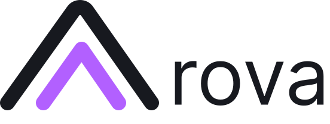

# Arova

**Follow the thread.**

Arova is a macOS workspace for keeping an AI coding agent on track — and checking that it actually reached the goal.

It pairs your normal interactive [Pi](https://github.com/badlogic/pi-mono) session with an independent supervisor. You keep working in the agent terminal; Arova observes the work, verifies files and tests, and surfaces evidence-based guidance when the task starts to drift.



## Why Arova

AI agents can produce a lot of activity without producing a finished result. Arova adds the missing execution-control layer:

- **Stay in the loop.** Work with a real interactive Pi session rather than a detached automation run.
- **Verify, do not assume.** The supervisor inspects changes and runs the configured checks before a goal is marked complete.
- **Keep the thread.** Goals, evidence, progress, and the next useful action remain connected across a long task.
- **Keep data local.** Arova runs on your Mac. Project state stays in a local `.goal-mode-pi/` folder and is never included in this repository or release.

## What you need

- Apple Silicon Mac (the first release is built for `arm64`)
- macOS 12 or newer
- An account or API credential for a supported AI provider

The DMG already includes the Node.js, Electron, and Pi runtimes that Arova needs. You do **not** need to install Node.js or Pi separately. On first use, configure or sign in to your preferred AI provider; credentials stay in your local environment or Pi configuration and are never included in the app.

For the full verification workflow inside a code repository, having Git available is recommended (install the macOS Command Line Tools if `git --version` is unavailable).

## Install

1. Download `Arova-0.1.1-arm64.dmg` from the [latest release](https://github.com/ChrisXHL/arova/releases/latest).
2. Open the DMG and drag **Arova** to Applications.
3. On first launch, control-click the app and choose **Open**. The app is not yet signed or notarized.
4. Configure your AI provider if prompted, then choose a project and start a task.

## Run from source

```bash
git clone https://github.com/ChrisXHL/arova.git
cd arova
npm ci --ignore-scripts
npm run app
```

For development in a browser:

```bash
npm run ui
```

Then visit `http://localhost:5780`.

## Build a macOS release

```bash
npm run typecheck
npm test
npm run dist:dmg
```

The DMG is written to `dist/`. Build artifacts are intentionally ignored by Git; attach the DMG to a GitHub Release instead.

## Privacy and repository policy

This public repository contains the application source, tests, documentation, and branding assets only. It deliberately excludes:

- local task history, session state, research notes, and memory (`.goal-mode-pi/`)
- local AI Skills and editor configuration (`.claude/`)
- environment files, credentials, keys, dependencies, and build output

No API keys are required in the app source. If you configure a provider or an optional search integration, its credentials remain in your local environment or local configuration.

## Development checks

```bash
npm run typecheck
npm test
```

## License

[MIT](LICENSE)
